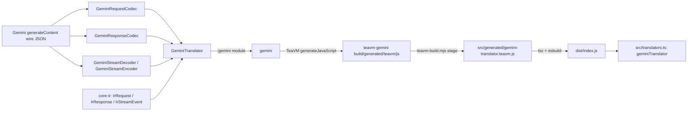

# gemini-translator

[](https://www.npmjs.com/package/gemini-translator)
[](https://www.npmjs.com/package/gemini-translator)

Gemini wire-format translator for the intisy-ai AI-proxy ecosystem.

Google Gemini `generateContent`/`streamGenerateContent` vendor translator for the canonical IR
(internal representation) used across the intisy AI-tooling ecosystem. Java + TeaVM single-source,
so the exact same request, response, and streaming codecs compile to a JVM jar and to a JS module:
any front-door or provider that needs to speak Gemini's wire format converts it to and from
`core-ir`'s neutral IR through one shared, tested implementation instead of a bespoke per-app
reimplementation.

## Under-the-Hood Architecture



`GeminiTranslator` implements `core-ir`'s `Translator` SPI: `decodeRequest`/`encodeRequest`,
`decodeResponse`/`encodeResponse`, and stateful `newStreamDecoder()`/`newStreamEncoder()` for true
streaming (no buffer-and-reconvert). The `:gemini` module holds the codecs and is
zero-dependency, Java-8-clean; `:teavm-gemini` is the TeaVM export surface over `:gemini` and
core-ir's `:ir` module, transpiled to a single JS bundle. The TS surface (`geminiTranslator`)
is a thin async wrapper over that generated JS, so callers never touch the TeaVM handle directly.

## Structure

- `src/index.ts` - `loadGeminiTranslator()`, a lazily-memoized dynamic import of the TeaVM ESM
  bundle, plus the public barrel re-exporting `translators.ts` and `core-ir`'s IR types.
- `src/translators.ts` - the public, typed TS API: `geminiTranslator`, with
  `decodeRequest`/`encodeRequest`/`decodeResponse`/`encodeResponse` (thin async wrappers over the
  TeaVM exports) and `decodeStream()`/`encodeStream()`, which return a real `TransformStream`
  driven chunk-by-chunk by the stateful Java handle.
- `src/driver.ts` - a small CLI driver (`node dist/driver.js <payload.json>`) that decodes a wire
  request to IR and re-encodes it, useful for manual smoke checks.
- `src/generated/gemini-translator.teavm.d.ts` - hand-authored ambient types for the staged JS
  (the `.js` itself is gitignored build output).
- `src/__tests__/` - `smoke.test.ts` (toolchain round trip) and `translators.test.ts` (request and
  response round trips).
- `gemini/` - the Gemini codecs (`GeminiRequestCodec`, `GeminiResponseCodec`,
  `GeminiStreamDecoder`, `GeminiStreamEncoder`, `GeminiBlockCodec`, `GeminiUsageCodec`,
  `GeminiFinishReason`, `GeminiJsonUtil`) plus `GeminiTranslator`, the `Translator`
  implementation that ties them together. Depends on core-ir's `:ir` module for the
  IR types and the codec SPI.
- `teavm-gemini/` - the TeaVM JS export surface (`GeminiTranslatorJs`), transpiling
  `:gemini` and `:ir` to `gemini-translator.js`.
- `settings.gradle` / `build.gradle` / `gradlew*` - self-contained Gradle build
  (Java 8 for `:gemini`, Java 17 override for `:teavm-gemini`), declaring core-ir's `:ir`
  module as a github-gradle coordinate.

## Installation

TypeScript, as a published npm package:

```bash
npm install @intisy-ai/gemini-translator
```

Java, as a `github-gradle` coordinate resolving this repo's released `:gemini` jar:

```groovy
githubImplementation "intisy-ai:gemini-translator:1.1.0:gemini"
```

No checkout of this repo or of `core-ir` is needed, or wanted: a nested checkout is a third
resolver beside the package manifest and the build file, and it can disagree with both.

## Usage

```ts
import { geminiTranslator } from "gemini-translator";

const ir = await geminiTranslator.decodeRequest(wireJson);
const backToWire = await geminiTranslator.encodeRequest(ir);

const response = await geminiTranslator.decodeResponse(responseWireJson);
const wireResponse = await geminiTranslator.encodeResponse(response);

const decodeStream = await geminiTranslator.decodeStream();
const irEvents = upstreamSseBody.pipeThrough(decodeStream); // ReadableStream<IrStreamEvent>

const encodeStream = await geminiTranslator.encodeStream();
const wireSse = irEventStream.pipeThrough(encodeStream); // ReadableStream<string>
```

`geminiTranslator` satisfies `core-ir`'s `VendorTranslator` interface, so any front-door that
already speaks that interface for another vendor can adopt Gemini support by swapping in this
translator.

## Testing

Java: `cd java && ./gradlew test` (JUnit 5, `:gemini` module: request, response, and streaming
round-trip tests against fixture payloads, plus a cross-vendor test proving a canonical IR request
built independently of any Gemini wire input translates into a valid Gemini body).

TS: `npm run build && npx vitest run` (`build` stages the TeaVM JS, `tsc`s, then bundles with
esbuild; `test` round-trips the translator from TS). Both layers use the same round-trip fixture
approach: a captured Gemini wire payload decoded to IR and re-encoded, asserting the result matches
the original shape rather than a byte-identical string.

## License

[](LICENSE)
